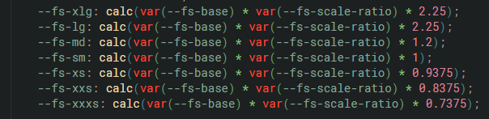

# Welcome to this week's project! 👋

##  Folder Structure

firstnameLastnameMobileFirstDesign/
&nbsp;  index.html
&nbsp;&nbsp;    css/
&nbsp;&nbsp;&nbsp;&nbsp;    core.css
&nbsp;&nbsp;&nbsp;&nbsp;    theme.css
&nbsp;&nbsp;&nbsp;&nbsp;    style.css
&nbsp;&nbsp;    assets/
&nbsp;&nbsp;&nbsp;&nbsp;    fonts/
&nbsp;&nbsp;&nbsp;&nbsp;    images/

##  To do this challenge, you need a good understanding of:

1.  Responsive Design (typography and media)
2.  ::before and ::after pseudo selectors
3.  Flexbox Grow and Shrink

## Check the following image to have a good starting point for font sizes: Remember you will need to find the perfect scale ratio

## Colors used

##  Research Skills are being tested

### Responsive Images

"picture" and "source" elements

### For the button hover effect, you will need the following tools:

Both :before and :after pseudo-selectors **MUST** be used

-   :before
-   :After
-   content 替换元素
-   position 布局
-   left and top

-   transform: translateX()沿 x 轴平移元素
-   transform: skewX() 水平方向倾斜元素的变换
-   background
-   filter: blur()模糊

## The only @media queries allowed for the page

-   Start coding at 320px

-   @media 48em - which is equivalent to 768px

-   @media 64 em - which is equivalent to 1024px

-   @media 90em - which is equivalent to 1440px

## Media queries allowed for typography

-   @media 36em - which is equivalent to 576px

-   @media 48em - which is equivalent to 768px

-   @media 64em - which is equivalent to 1024px

-   @media 87.5em - which is equivalent to 1400px

## You are not allowed to use:

-   Max-widths on parent of images

-   Flex-wrap

### Tips:

-   **REMEMBER** the browser is responsive by default, start working at 320px

-   **START** with 320px and layout **ALL** the elements for HTML with no styles. Everything should be
    a block under the other as that is the way for mobile. Then apply styles and start changing the screen size to check when the design breaks

-   You do no need **max-widths** for the parent of the image. Let the images be responsive within the container

-   Media queries should have few changes like flexbox, margin or paddings but no whole
    new styles all together

-   For responsive typography, make sure to change the "fs-scale-ratio" so that your fonts is always responsive

**Have fun building!** 🚀

# 欢迎来到本周的项目! 👋

## 文件夹结构

firstnameLastnameMobileFirstDesign/
&nbsp; index.html
&nbsp;&nbsp; css/
&nbsp;&nbsp;&nbsp;&nbsp; core.css
&nbsp;&nbsp;&nbsp;&nbsp; theme.css
&nbsp;&nbsp;&nbsp;&nbsp; style.css
&nbsp;&nbsp; assets/
&nbsp;&nbsp;&nbsp;&nbsp; fonts/（字体）。
&nbsp;&nbsp;&nbsp;&nbsp;图像/

## 要做这个挑战，你需要很好地理解。

1.  响应式设计（排版和媒体）。
    2.:before 和:after 伪选择器
3.  Flexbox增长和收缩

##查看下面的图片，对字体大小有一个好的起点。记住，你需要找到完美的缩放比例

## 使用的颜色

## 研究技能正在被测试

###响应式图片

"图片 "和 "来源 "元素

### 对于按钮的悬停效果，你将需要以下工具。

:before 和 :after 伪选择器都必须***使用

- :before
- :之后
- 内容
- 位置
- 左侧和顶部

- transform: translateX()
- 变换: skewX()
- 背景
- filter: blur()

## 该页面唯一允许的@媒体查询

- 在320px处开始编码

- @media 48em - 相当于768px

- @media 64 em - 相当于1024px

- @media 90em - 相当于1440px

## 允许用于排版的媒体查询

- @media 36em - 相当于576px

- @media 48em - 相当于768px

- @media 64em - 相当于1024px

- @media 87.5em - 相当于1400px

## 你不允许使用。

- 在图片的父本上使用最大宽度

- Flex-wrap

###提示。

- **记住**浏览器默认是响应式的，从320px开始工作。

- 从320px开始，把所有的HTML元素布局在没有样式的地方。一切都应该是
  块，因为这是在手机上的做法。然后应用样式，并开始改变屏幕尺寸，以检查设计是否中断。

- 你不需要为图片的父本设置***最大宽度。让图像在容器中响应。

- 媒体查询应该有一些变化，如flexbox、margin或paddings，但不需要整个
  新的样式

- 对于响应式排版，确保改变 "fs-scale-ratio"，使你的字体始终是响应式的。

**祝你建设愉快！** 🚀
