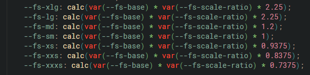
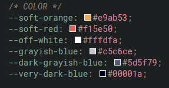

# Welcome to this week's project! 👋

##  Folder Structure

firstnameLastnameMobileFirstDesign/
&nbsp;  index.html
&nbsp;&nbsp;    css/
&nbsp;&nbsp;&nbsp;&nbsp;    core.css
&nbsp;&nbsp;&nbsp;&nbsp;    theme.css
&nbsp;&nbsp;&nbsp;&nbsp;    style.css
&nbsp;&nbsp;    assets/
&nbsp;&nbsp;&nbsp;&nbsp;    fonts/
&nbsp;&nbsp;&nbsp;&nbsp;    images/

##  To do this challenge, you need a good understanding of: 

1.  Responsive Design (typography and media)
2.  ::before and ::after pseudo selectors
3.  Flexbox Grow and Shrink

## Check the following image to have a good starting point for font sizes: Remember you will need to find the perfect scale ratio

## Colors used

##  Research Skills are being tested

### Responsive Images

"picture" and "source" elements

### For the button hover effect, you will need the following tools:

Both :before and :after pseudo-selectors **MUST** be used

-   :before
-   :After
-   content
-   position
-   left and top

-   transform: translateX()
-   transform: skewX()
-   background
-   filter: blur()

## The only @media queries allowed for the page

-   Start coding at 320px

-   @media 48em - which is equivalent to 768px

-   @media 64 em - which is equivalent to 1024px

-   @media 90em - which is equivalent to 1440px

## Media queries allowed for typography

-   @media 36em - which is equivalent to 576px

-   @media 48em - which is equivalent to 768px

-   @media 64em - which is equivalent to 1024px

-   @media 87.5em - which is equivalent to 1400px

## You are not allowed to use:

-   Max-widths on parent of images

-   Flex-wrap

### Tips:

-   **REMEMBER** the browser is responsive by default, start working at 320px

-   **START** with 320px and layout **ALL** the elements for HTML with no styles. Everything should be
    a block under the other as that is the way for mobile. Then apply styles and start changing the screen size to check when the design breaks 

-   You do no need **max-widths** for the parent of the image. Let the images be responsive within the container 

-   Media queries should have few changes like flexbox, margin or paddings but no whole
    new styles all together

-   For responsive typography, make sure to change the "fs-scale-ratio" so that your fonts is always responsive

**Have fun building!** 🚀
